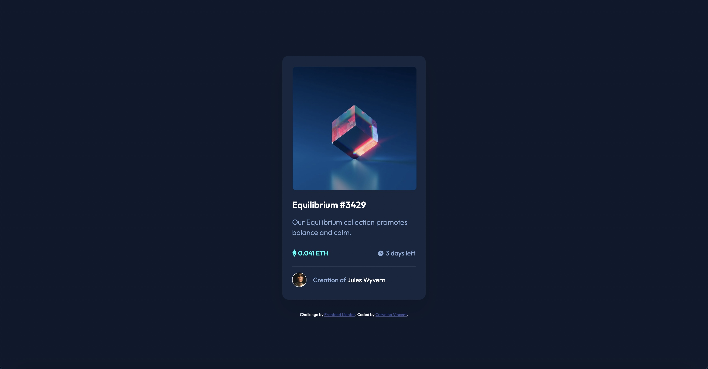

# Frontend Mentor - NFT preview card component solution

This is a solution to the [NFT preview card component challenge on Frontend Mentor](https://www.frontendmentor.io/challenges/nft-preview-card-component-SbdUL_w0U). Frontend Mentor challenges help you improve your coding skills by building realistic projects. 

## Table of contents

- [Overview](#overview)
  - [The challenge](#the-challenge)
  - [Screenshot](#screenshot)
  - [Links](#links)
- [My process](#my-process)
  - [Built with](#built-with)
  - [What I learned](#what-i-learned)
  - [Continued development](#continued-development)
  - [Useful resources](#useful-resources)
- [Author](#author)
- [Acknowledgments](#acknowledgments)

## Overview

### The challenge

Users should be able to:

- View the optimal layout depending on their device's screen size
- See hover states for interactive elements

### Screenshot

### Links

- Solution URL: [https://github.com/samuearthur/nft-preview-card-component]
- Live Site URL: [https://carvalhovincent.github.io/nft-preview-card-component/]

## My process

### Built with

- CSS
- Flexbox
- Mobile-first workflow

### What I learned

Learned how to overlay an image, and how to place different elements on my page in a better way.
Also improved my inspector skills and global understanding of how to build a webpage.
I learned how to detail code and make it simple for another developer to read or use.

### Continued development

Need to be more efficient, on building a placing elements like images, div, flexbox etc...
Continue learning how different properties works together.
Improve responsive skills.
 
### Useful resources

- [https://www.w3schools.com] - Used it for some reminders.
- [https://stackoverflow.com/ ] - Used for some information.

## Author

- Frontend Mentor - [@samuearthur]